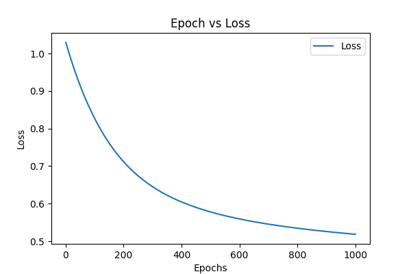
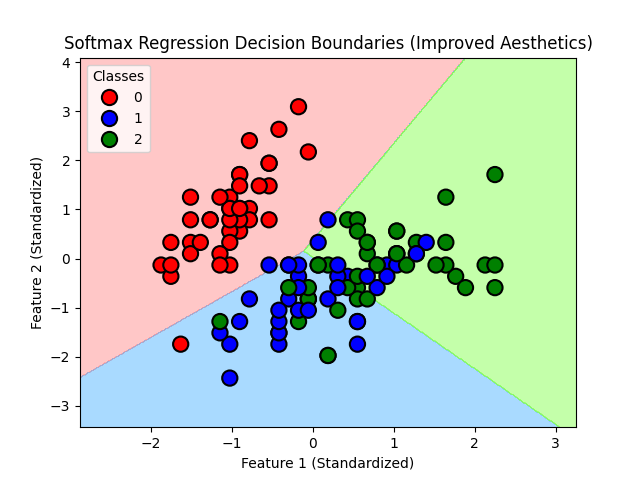

Softmax Regression from Scratch
This repository contains an end-to-end implementation of Softmax Regression from scratch using only NumPy. The goal is to build a clear understanding of how Softmax Regression works, covering the forward pass, loss calculation, gradient computation, and weight updates through gradient descent.

📌 Overview
Softmax Regression is a classification algorithm used when the target variable has multiple classes. It extends logistic regression to handle multi-class classification problems by assigning probabilities to each class.

📖 Prerequisites
Knowledge of linear algebra (matrix multiplication, dot product)
Understanding of logistic regression and gradient descent
Familiarity with NumPy for numerical computations

Key Topics Covered
✔️ Forward Pass: Computing logits
✔️ Applying Softmax: Converting logits into probabilities
✔️ Cross-Entropy Loss: Measuring the model’s performance
✔️ Gradient Computation: Using backpropagation to compute gradients
✔️ Weight Updates: Applying gradient descent to update parameters
✔️ Visualization: Decision boundary and loss reduction

📂 Project Structure

Softmax_Regression_from_Scratch/
│-- Notebooks/
│   ├── Softmax_regression.ipynb  # Jupyter Notebook with full explanation
│   ├── accuracy.txt              # Accuracy of the trained model
│
│-- Images/
│   ├── loss_plot.png             # Loss reduction over iterations
│   ├── decision_boundary.png     # Final decision boundary
│
│-- requirements.txt              # Dependencies for running the notebook
│-- README.md                     # Project documentation

You can run the notebook step by step to understand how Softmax Regression works. Each section is explained with clear code and mathematical derivations.

## 📊 Results & Visualization

### 🔹 Accuracy
The final accuracy of the Softmax Regression model:

**🔥 Accuracy: 90 %**

### 🔹 Loss Reduction
The model's loss decreases over time, indicating successful learning.

### 🔹 Decision Boundary
The decision boundary visualization shows how the model classifies different regions.

